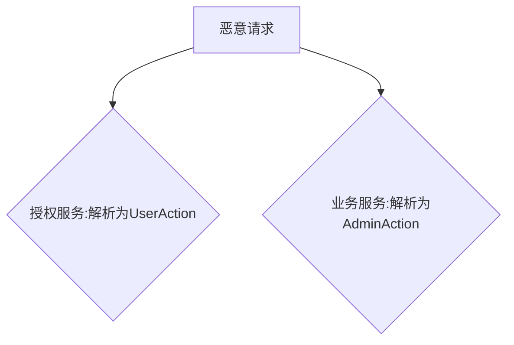

# Go语言解析器中的意外安全陷阱

在Go应用程序中，解析不可信数据会形成危险的攻击面。通过三个真实攻击场景，我们揭示了Go标准库解析器中的安全隐患：

## 攻击场景1：意外(反)序列化数据

当开发者使用`json:"-"`标记试图阻止字段被反序列化时，错误添加的逗号后缀会导致该字段仍可通过`"-"`键被修改：
```go
type User struct {
    IsAdmin bool `json:"-,omitempty"` // 错误配置：仍可通过{"-":true}注入
}
```
我们创建的Semgrep规则可检测此类问题：`semgrep -c r/trailofbits.go.unmarshal-tag-is-dash`

## 攻击场景2：解析器差异

Go的JSON解析器存在两项危险特性：
1. **重复键处理**：总是取最后出现的键值
2. **大小写不敏感匹配**：`"action"`、`"ACTION"`甚至Unicode变体(`aKtionſ`)都会被匹配

当微服务架构中不同组件使用不同解析器时，这种差异会导致权限绕过：


## 攻击场景3：数据格式混淆

通过构造特殊的多格式混合文件(Polyglot)，可使JSON/XML/YAML解析器解析同一文件时产生不同结果：
```json
{
    "action": "Action_1",
    "aCtIoN": "Action_2",
    "comment": "<action>Action_3</action>"
}
```
该payload会：
- JSON解析为`Action_2`（取最后匹配+大小写不敏感）
- YAML解析为`Action_1`（精确匹配）
- XML解析为`Action_3`（提取XML片段）

## 防护建议

1. **启用严格模式**：
   ```go
   decoder := json.NewDecoder(reader)
   decoder.DisallowUnknownFields()
   ```
2. **期待JSON v2**：将默认禁止重复键并启用大小写敏感匹配
3. **边界一致性检查**：跨服务处理时验证数据格式一致性
4. **使用静态分析**：我们提供的Semgrep规则可检测常见错误配置

这些解析器特性已导致真实漏洞，包括Hashicorp Vault认证绕过(CVE-2020-16250)等案例。开发者需要特别警惕大小写不敏感匹配这类Go特有行为。